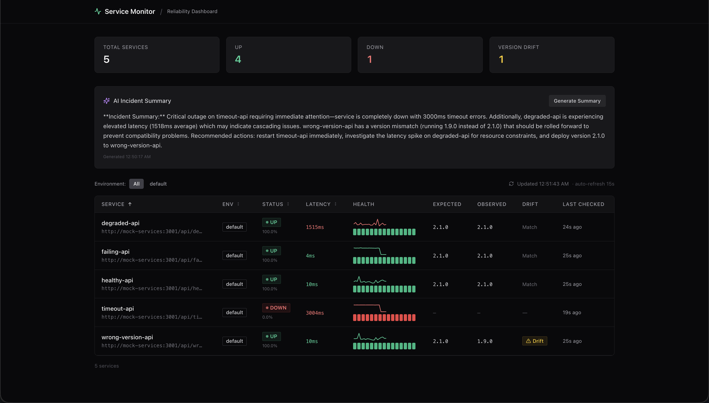
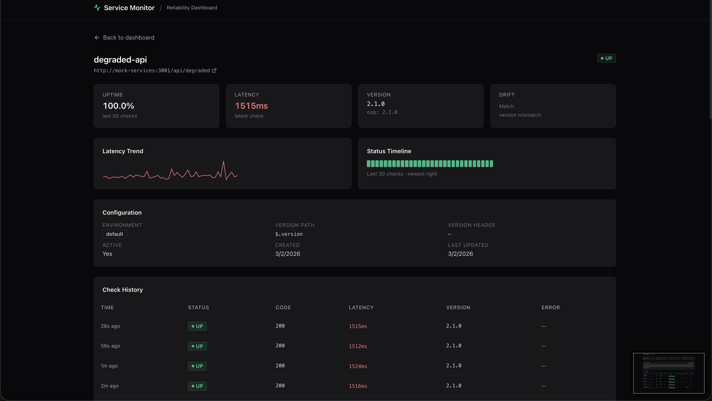

# Service Reliability Monitor

A lightweight, self-hosted service reliability monitor. Periodically polls HTTP endpoints, detects availability and version drift, persists results, and surfaces a live dashboard with a REST API.

**Stack:** TypeScript · Next.js 15 (App Router) · Tailwind CSS · shadcn/ui · Drizzle ORM · PostgreSQL · Docker · AWS (App Runner + RDS)

### Dashboard



### Service Detail



---

## Quickstart

```bash
# 1. Clone and copy environment config
cp .env.example .env.local

# 2. Start the full stack (Postgres + mock services + app)
docker compose up --build

# Dashboard → http://localhost:3000
# Mock services → http://localhost:3001
```

**Live demo:** https://muvskmgspm.ap-southeast-1.awsapprunner.com

The `app` container automatically applies database migrations on startup before booting the Next.js server.

### Adding services to monitor

Edit `services.yaml` to add your own endpoints. The poller reads this file on startup and syncs it to the database — new entries are inserted, removed entries are soft-deleted (history preserved).

```yaml
services:
  # Minimal — just a name and URL
  - name: my-api
    url: https://api.example.com/health
    env: production

  # With version drift detection
  - name: auth-service
    url: https://auth.example.com/health
    env: production
    expected_version: "3.0.0"
    version_path: "$.version"        # extract from JSON response body

  # Mock service with env var interpolation (defaults to Docker Compose hostname)
  - name: healthy-api
    url: ${MOCK_SERVICES_URL:-http://mock-services:3001}/api/healthy
    env: mock
    expected_version: "2.1.0"
    version_path: "$.version"
```

After editing, restart the poller (`docker compose restart app` or restart `npm run dev`) to pick up changes.

### Run without Docker (local dev)

```bash
# Prerequisites: Node 22+, a running Postgres instance

# Install dependencies
npm install

# Start Postgres (Docker only, no app)
docker compose up db -d

# Copy and configure environment
cp .env.example .env.local
# Edit .env.local — set DATABASE_URL if different

# Apply migrations
npm run db:migrate

# Start development server (poller runs via instrumentation.ts)
npm run dev

# Dashboard → http://localhost:3000
```

---

## Architecture

```
┌──────────────────────────────────────────────────────────┐
│  Next.js Container                                       │
│                                                          │
│  ┌─────────────────┐  ┌───────────────────────────────┐  │
│  │  Dashboard UI   │  │  API Route Handlers           │  │
│  │  (React / SSR)  │  │  GET /api/services            │  │
│  │  TanStack Query │  │  GET /api/services/:id        │  │
│  │  auto-refresh   │  │  GET /api/services/:id/       │  │
│  └─────────────────┘  │       history                 │  │
│                        │  GET /api/monitor/health      │  │
│                        │  GET /api/incidents/summary ──┼──┼──► Anthropic API
│                        │  POST /api/run-once           │  │    (Claude Haiku)
│                        └───────────────────────────────┘  │
│                                                          │
│  ┌─────────────────────────────────────────────────────┐  │
│  │  Poller (instrumentation.ts)                        │  │
│  │  · setInterval loop (configurable)                  │  │
│  │  · Concurrent HTTP checks (p-limit, max 10)         │  │
│  │  · Version extraction: JSON path + header           │  │
│  │  · Incident detection: down/drift/flapping/degraded │  │
│  │  · Consecutive failure alerting + webhook           │  │
│  │  · Run lock (no overlapping cycles)                 │  │
│  │  · Retention: 7-day age + 500/service cap           │  │
│  └─────────────────────────────────────────────────────┘  │
└──────────────────────────┬───────────────────────────────┘
                           │
                    ┌──────▼──────┐
                    │  PostgreSQL  │
                    └──────▲──────┘
                           │
┌──────────────────────────┴───────────────────────────────┐
│  Standalone Worker (worker.ts)                            │
│  Same poller code, separate process (ECS Fargate target)  │
└──────────────────────────────────────────────────────────┘

┌──────────────────────────────────────────────────────────┐
│  Mock Services (Express)                                  │
│  GET /api/healthy       → 200, version "2.1.0"            │
│  GET /api/degraded      → 200, 1.5 s delay                │
│  GET /api/wrong-version → 200, version "1.9.0"            │
│  GET /api/failing       → 503 every other request         │
│  GET /api/timeout       → hangs 10 s                      │
└──────────────────────────────────────────────────────────┘
```

### Design Overview

The monitor uses a **polling-based** approach rather than requiring webhooks or agents on monitored services. This is a deliberate trade-off: polling works with any HTTP endpoint out of the box — no registration, no callback URLs, no firewall rules. The 30-second default interval balances detection speed against load on monitored services.

Service definitions follow a **config-as-code** philosophy. `services.yaml` is the source of truth, version-controlled alongside application code. On startup, the poller syncs this file to the database — inserting new services, updating changed ones, and soft-deleting removed ones (preserving their check history).

Data retention uses a **dual strategy**: age-based (default 7 days) and count-based (default 500 per service). At 30-second intervals, a single service generates ~20k checks per week. The age window handles normal cleanup; the per-service cap acts as a safety net against accumulation.

For detailed diagrams and data flow descriptions, see [docs/architecture.md](docs/architecture.md).

---

## Configuration

### Service Config (`services.yaml`)

Defines which endpoints to monitor. The poller reads this file on startup and upserts to the database. Removing a service soft-deletes it (sets `is_active = false`), preserving history.

```yaml
services:
  - name: healthy-api
    url: ${MOCK_SERVICES_URL:-http://mock-services:3001}/api/healthy
    env: mock
    expected_version: "2.1.0"
    version_path: "$.version"          # JSON path extraction

  - name: github-api
    url: https://api.github.com
    env: production                    # No version tracking — just availability
```

| Field              | Required | Description                                       |
|--------------------|----------|---------------------------------------------------|
| `name`             | ✓        | Unique display name                               |
| `url`              | ✓        | Full HTTP/HTTPS endpoint URL                      |
| `env`              |          | Environment tag (default: `default`)              |
| `expected_version` |          | Expected version string — enables drift detection |
| `version_path`     |          | JSONPath expression to extract version from body  |
| `version_header`   |          | Response header containing the version string     |

### Environment Variables

| Variable                  | Default                    | Description                           |
|---------------------------|----------------------------|---------------------------------------|
| `DATABASE_URL`            | *(required)*               | PostgreSQL connection string          |
| `POLL_INTERVAL_MS`        | `30000`                    | Milliseconds between poll cycles      |
| `CHECK_TIMEOUT_MS`        | `3000`                     | Per-request HTTP timeout              |
| `CONCURRENCY_LIMIT`       | `10`                       | Max concurrent checks per cycle       |
| `ALERT_THRESHOLD`         | `3`                        | Consecutive failures before alerting  |
| `RETRY_DELAY_MS`          | `500`                      | Delay before single transient retry   |
| `ALERT_WEBHOOK_URL`       | *(empty)*                  | Webhook for Slack/Discord/PagerDuty   |
| `RETENTION_DAYS`          | `7`                        | Delete checks older than N days       |
| `MAX_CHECKS_PER_SERVICE`  | `500`                      | Cap stored checks per service         |
| `ANTHROPIC_API_KEY`       | *(empty)*                  | Enables AI incident summaries (Haiku) |
| `NODE_ENV`                | `development`              | `development` or `production`         |

---

## API Reference

### `GET /api/services`
Returns all services with their latest check snapshot.

```json
[
  {
    "id": "uuid",
    "name": "Healthy API",
    "url": "http://...",
    "env": "mock",
    "isActive": true,
    "expectedVersion": "2.1.0",
    "latestCheck": {
      "ok": true,
      "statusCode": 200,
      "latencyMs": 42,
      "observedVersion": "2.1.0",
      "hasDrift": false,
      "checkedAt": "2026-01-01T00:00:00.000Z"
    }
  }
]
```

### `GET /api/services/:id`
Single service with metadata and latest check.

### `GET /api/services/:id/history?limit=50`
Recent checks for a service (default limit: 50, max: 200).

### `GET /api/monitor/health`
Monitor heartbeat — returns `ok` and timestamp of last completed poll.

```json
{ "ok": true, "lastRunAt": "2026-01-01T00:00:00.000Z" }
```

### `GET /api/incidents/summary`
AI-generated incident summary. Analyzes current service health, detects incidents (down, flapping, drift, degraded), and uses Claude Haiku to produce an actionable summary. Returns 503 if `ANTHROPIC_API_KEY` is not configured.

```json
{
  "summary": "failing-api is currently down with a 503 error...",
  "incidents": [{ "serviceName": "failing-api", "type": "down", "severity": "critical", "details": "..." }],
  "generatedAt": "2026-01-01T00:00:00.000Z"
}
```

### `POST /api/run-once`
Triggers an immediate out-of-band poll cycle. Returns poll summary.

---

## Project Structure

```
service-reliability/
├── src/
│   ├── app/                    # Next.js App Router (pages + API routes)
│   ├── components/             # React components (UI + domain)
│   ├── lib/
│   │   ├── config/             # YAML loader, schema validation, DB sync
│   │   ├── db/                 # Drizzle schema, migrations, client
│   │   ├── monitoring/         # HTTP checker, version extractor, alerting, retention, orchestrator
│   │   ├── services/           # Service query helpers + response types
│   │   └── logger.ts           # pino (JSON in prod, pretty in dev)
│   ├── worker.ts               # Standalone poller entry (production-ready, not yet deployed via CI/CD)
│   └── instrumentation.ts      # Next.js hook → starts poller in dev
├── __tests__/                  # Vitest tests mirroring src structure
├── mock-services/              # Express mock server (demo endpoints)
├── scripts/
│   ├── migrate.mjs             # Runtime migration runner (used by Docker startup)
│   └── start.sh                # Docker entrypoint: migrate → start Next.js
├── services.yaml               # Service monitor config (source of truth)
├── docker-compose.yml          # Local: Postgres + mock-services + app
├── Dockerfile                  # Multi-stage: runner + worker targets
└── drizzle.config.ts
```

---

## Scripts

| Command             | Description                                  |
|---------------------|----------------------------------------------|
| `npm run dev`       | Start Next.js dev server (poller auto-starts)|
| `npm run build`     | Production build                             |
| `npm run start`     | Start production server                      |
| `npm run test`      | Run tests in watch mode                      |
| `npm run test:run`  | Run tests once (CI)                          |
| `npm run lint`      | ESLint                                       |
| `npm run db:generate` | Generate Drizzle migrations from schema    |
| `npm run db:migrate`  | Apply pending migrations                   |

---

## Design Decisions

| Decision | Choice | Rationale |
|---|---|---|
| **Poller entry points** | Dual: `instrumentation.ts` (embedded) + `worker.ts` (standalone) | Same poller code, different entry points. Production currently uses embedded mode via `instrumentation.ts`. Standalone `worker.ts` is available but not yet wired into CI/CD. |
| **ORM** | Drizzle | Lightweight, SQL-like, TypeScript-native. Smaller bundle than Prisma. |
| **Config format** | YAML → DB upsert (soft delete) | YAML is version-controlled source of truth. DB enables relational queries. Removed services are marked inactive, history is preserved. |
| **Version extraction** | JSON path + response header | Per-service config. Covers REST APIs (body) and legacy services (headers). |
| **Parse error handling** | `ok = true`, `observedVersion = null` | Availability ≠ version. A service can be up but return malformed JSON. Logged as a warning. |
| **Alerting** | Consecutive failures + rate limit | Avoids alert storms. One alert per incident per 10 minutes. Webhook works with Slack/Discord/PagerDuty. |
| **Retention** | 7-day age window + 500/service cap | At 30s intervals: ~20k checks/service/week. Dual strategy handles both time and count runaway. |
| **Dashboard data** | SSR initial data + TanStack Query refresh | Fast first paint via server render. Client auto-refreshes every 15s without a full page reload. |
| **Sparklines** | Pure SVG | No heavy charting library. Keeps bundle small. |
| **Testing** | Full TDD (Vitest) | Tests written before implementation for all core logic, API routes, and components. |
| **AI incident summary** | Claude Haiku (claude-haiku-4-5-20251001) | Fast (<1s), cheap. On-demand only (no auto-fetch) to avoid burning API credits. Graceful degradation when API key is missing. |

---

## Infrastructure (AWS Deployment)

Production runs on **AWS App Runner** with two services:

- **web** — Next.js (dashboard + API routes + embedded poller). Auto-deploys on ECR image push. Health-checked at `/api/health`.
- **mock-services** — Express demo server. Auto-deploys independently. URL injected at runtime via `MOCK_SERVICES_URL` env var (set by Terraform from the mock service's App Runner URL).

**RDS PostgreSQL** (`db.t3.micro`, single-AZ, Postgres 16) serves as the shared data store. Environment variables — including `DATABASE_URL` — are set via Terraform `runtime_environment_variables`, not Secrets Manager. The database password is passed as a Terraform variable sourced from the `DB_PASSWORD` GitHub Secret.

Structured pino JSON logs flow to CloudWatch via App Runner's built-in log streaming. Use CloudWatch Logs Insights to query structured fields directly.

For full infrastructure details, CI/CD pipeline documentation, and deployment troubleshooting, see [docs/ci-cd.md](docs/ci-cd.md).

---

## Production Gotchas

- **`DATABASE_URL` not validated at startup** — the lazy Proxy defers pool creation to the first query, so a missing or invalid connection string won't surface until the first API call or poll cycle.
- **In-memory alert state resets on every deploy** — consecutive failure counters and rate-limit timestamps live in memory. A redeploy resets them, which can cause a duplicate alert for an ongoing incident.
- **Connection pool limits** — each App Runner instance opens up to 20 connections. `db.t3.micro` supports ~85 connections, so you can safely run ~4 instances before hitting the limit. Scale beyond that requires PgBouncer or an RDS upgrade.
- **Health endpoint returns 200 before first poll** — on a fresh deploy, `/api/monitor/health` returns `ok: true` with `lastRunAt: null` because no poll cycle has completed yet. Upstream health checks should account for this.
- **`services.yaml` changes require a poller restart** — there is no hot-reload. After editing the config, restart the container or process to pick up changes.
- **Retention cap of 500 checks is ~4 hours at 30s intervals** — if you need longer history, increase `MAX_CHECKS_PER_SERVICE` or lower the poll frequency.
- **TLS/DNS errors trigger immediate consecutive failure alerts** — these are not retried (by design), so a DNS blip can escalate to an alert after just 3 cycles (90 seconds at default interval).
- **No recovery/resolved alerts** — the system alerts when a service goes down but does not notify when it comes back up.
- **Migration failure blocks web server startup** — the Docker entrypoint runs migrations before starting Next.js. A bad migration will prevent the container from starting.

---

## Future Improvements

- **Standalone worker deployment** — wire `worker.ts` into CI/CD as an ECS Fargate task, decoupling polling from the web server.
- **Recovery alerts** — notify when a previously-down service returns to healthy.
- **Persistent alert state** — move consecutive failure counters and rate-limit timestamps from in-memory Maps to the database, eliminating duplicate alerts on redeploy.
- **Connection pooling** — add PgBouncer as a sidecar or upgrade the RDS instance class to support more App Runner instances.
- **DNS retry policy** — add a short retry window for transient `ENOTFOUND` errors to reduce false-positive alerts during DNS propagation.
- **Hot-reload for `services.yaml`** — watch the config file for changes and re-sync without a full restart.
- **Dashboard empty state / onboarding UX** — show a guided setup experience when no services are configured instead of an empty table.

---

## Further Reading

| Document | Description |
|---|---|
| [docs/architecture.md](docs/architecture.md) | C4 diagrams (system context + container), data flow narratives, design choices |
| [docs/ci-cd.md](docs/ci-cd.md) | GitHub Actions workflows, Terraform operations, deployment pipeline, infrastructure module map |
| [docs/runbook.md](docs/runbook.md) | Production operations: health checks, log queries, common issues, scaling, database maintenance, alert handling |

---

## AI-Assisted Development

This project uses [Claude Code](https://docs.anthropic.com/en/docs/claude-code) as a core development tool — not just for autocomplete, but as a structured collaborator that writes code, runs tests, and creates PRs. The workflow relies on guardrails (CLAUDE.md files and custom skills) that encode project conventions so the AI operates within well-defined boundaries.

### CLAUDE.md as Project Guardrails

Claude Code reads `CLAUDE.md` files at the start of every session, acting as a persistent project briefing. This project uses a two-tier configuration:

- **Global** (`~/.claude/CLAUDE.md`) — developer-specific preferences: commit style, plan mode behavior, educational explanations during implementation.
- **Project** (`CLAUDE.md` at repo root) — repository-specific rules checked into version control: architecture context, codemap, stack details, conventions, environment variables, and accumulated lessons learned.

The project-level file means any developer who clones the repo inherits the same guardrails — same conventional commit format, same testing approach (Vitest with globals), same architectural constraints (lazy DB proxy, dependency injection for testability). There's no "tribal knowledge" that only lives in someone's head.

`CLAUDE.md` is version-controlled and evolves with the codebase. The "Lessons Learned" section grows as the team discovers gotchas (e.g., "only retry transient errors", "run lock prevents HTTP storms"), so the AI doesn't repeat past mistakes.

### Plan Mode

Before non-trivial work, the workflow starts with `/plan` mode:

1. The AI explores the codebase — reads relevant files, searches for patterns, understands existing architecture.
2. It asks clarifying questions about constraints, tradeoffs, edge cases, and UX concerns (enforced by a global CLAUDE.md rule that requires an interview step before finalizing any plan).
3. It produces a written implementation plan with specific files, changes, and verification steps.
4. The developer reviews and approves (or revises) before any code is written.

This prevents the AI from charging ahead with the wrong approach on ambiguous tasks, surfaces architectural tradeoffs early, and creates a paper trail of design decisions.

### Custom Skills

Skills are reusable workflow definitions invoked via `/skill-name` that encode multi-step processes:

| Skill | Purpose |
|---|---|
| `/tdd-workflow` | Enforces test-driven development: write failing tests first, implement to pass, target 80%+ coverage |
| `/preflight` | Pre-push pipeline: lint → type-check → build (fail-fast), then auto-generates a conventional commit message |
| `/pr` | Gathers branch context, detects linked GitHub issues, creates a PR with a structured summary and test plan |
| `/coding-standards` | Applies project-wide TypeScript/React best practices during implementation |

Skills make the AI workflow repeatable and consistent. A new developer can run `/preflight` without knowing the team's commit conventions or `/tdd-workflow` without memorizing the testing patterns — the skill encodes the process.

### Multi-Agent Teams

For complex features that span multiple domains (e.g., backend API + frontend components + infrastructure changes), Claude Code can spawn specialist agents that work in parallel on a shared task list. Each agent gets a scoped role and constraints — one handles database queries, another builds React components, a third writes tests — while a team lead agent coordinates task assignment and integration. This parallelizes independent work streams while keeping each agent focused on its domain.

### Motivations

- **Reproducibility over heroics** — CLAUDE.md + skills ensure any developer (or AI session) produces consistent output regardless of who's driving.
- **Plan before you build** — plan mode forces alignment on approach before code is written, reducing throwaway work.
- **Guardrails, not gatekeeping** — the goal isn't to limit the AI but to encode what "good" looks like for this project so it can move fast within safe boundaries.
- **The codebase teaches itself** — the CLAUDE.md codemap, architecture notes, and lessons learned mean the AI doesn't start from zero each session.
