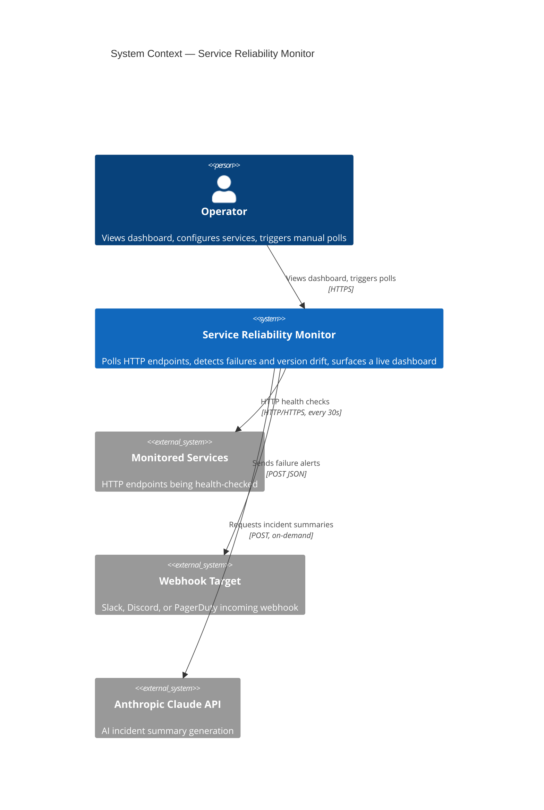
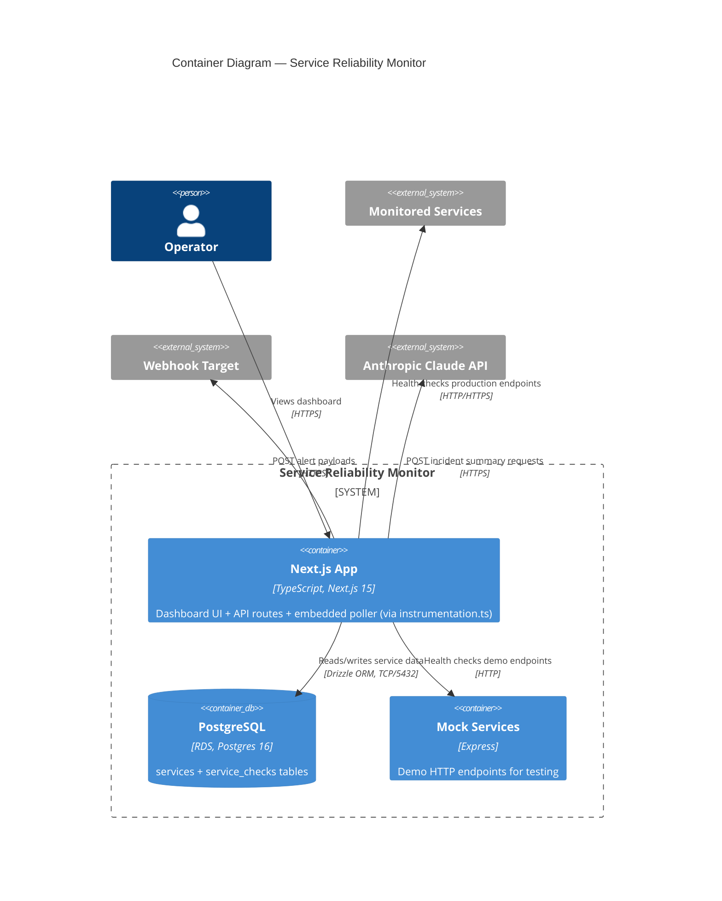

# Architecture

System architecture for the Service Reliability Monitor. Diagrams use the [C4 model](https://c4model.com/) rendered with [Mermaid](https://mermaid.js.org/).

---

## L1 — System Context

Who uses the system and what external systems does it interact with?



---

## L2 — Container Diagram

What runs inside the system boundary?



**Note on the worker target:** The Dockerfile defines a `worker` build target for standalone poller deployment (`src/worker.ts`), but CI/CD currently only builds the `runner` target. In production, the poller runs embedded in the Next.js process via `instrumentation.ts`.

---

## Data Flows

### 1. Config Sync

On startup, the poller loads `services.yaml` and syncs it to the database.

```
services.yaml
  → Zod schema validation (ServiceConfigSchema)
  → DB upsert per service
    - New services: INSERT
    - Existing services: UPDATE (url, env, version config)
    - Removed services: soft-delete (is_active = false), history preserved
```

### 2. Poll Cycle

Runs on a `setInterval` (default 30s). Each cycle:

```
setInterval tick
  → Load all active services from DB
  → Concurrent HTTP checks (p-limit, max 10 parallel)
    → Per check:
      - HTTP GET with timeout (default 3s)
      - Single retry on transient failure (500ms delay)
      - Extract version from JSON body (JSONPath) or response header
      - Persist check result to service_checks table
      - Evaluate alert: consecutive failures ≥ threshold (default 3)
        → Rate-limited webhook POST (max 1 per service per 10 minutes)
  → Run retention (best-effort, outside run lock):
    - Delete checks older than 7 days
    - Cap at 500 checks per service (keep most recent)
```

The cycle uses a **run lock** — if a previous cycle is still executing when the next tick fires, the new tick is skipped with a warning log.

### 3. Dashboard Render

```
Browser request
  → SSR: Next.js server-renders initial page with fresh DB query
  → Client hydration: TanStack Query takes over
    → Auto-refetch every 15 seconds (configurable)
    → Sparkline charts rendered as pure SVG (no charting library)
```

---

## Key Design Choices

| Choice | Rationale |
|---|---|
| Embedded poller (not standalone worker) | Single container simplifies deployment. App Runner manages scaling and health. The standalone `worker.ts` exists as an escape hatch if the poller needs independent lifecycle management. |
| Polling (not webhooks) | Works with any HTTP endpoint — no agent installation or callback registration required on monitored services. |
| Config-as-code (`services.yaml`) | Service definitions are version-controlled. DB is the runtime store; YAML is the source of truth. |
| Dual retention (age + count) | At 30s intervals, a single service generates ~20k checks/week. Age-based cleanup handles normal operation; count-based cap prevents runaway accumulation. |
| In-memory alert state | Consecutive failure counters and rate-limit timestamps live in process memory. Restarting the process resets alert state — this is acceptable because a restart also means fresh health checks will immediately re-evaluate. |
