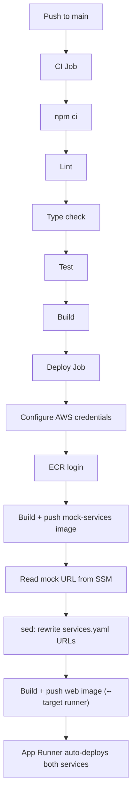

# CI/CD & Infrastructure

How code gets built, tested, and deployed, and what infrastructure supports it.

---

## Overview

Three GitHub Actions workflows, each with path-filtered triggers:

| Workflow | Trigger | Purpose |
|---|---|---|
| [CI + Deploy](../.github/workflows/ci-deploy.yml) | Push to `main` (non-terraform, non-docs) | Lint, test, build, push images, App Runner auto-deploys |
| [Terraform](../.github/workflows/terraform.yml) | Push/PR to `main` (`terraform/**`) | Plan on PR (comment), apply on merge |
| [Destroy](../.github/workflows/destroy.yml) | Manual (`workflow_dispatch`) | Tear down all Terraform-managed infrastructure |

---

## CI + Deploy Workflow

Runs on every push to `main` that modifies application code (ignores `terraform/**` and `**.md`).



### Step Details

1. **CI job** — Standard Node.js 22 pipeline: `npm ci` → `npm run lint` → `npx tsc --noEmit` → `npm run test:run` → `npm run build`
2. **Deploy job** (runs after CI passes):
   - Configures AWS credentials from GitHub Secrets
   - Logs in to Amazon ECR
   - Builds and pushes `mock-services` image (tagged with commit SHA + `latest`)
   - Reads the mock-services App Runner URL from SSM Parameter Store (`/service-monitor/mock-services-url`)
   - Rewrites `services.yaml` — replaces `http://mock-services:3001` with the live App Runner URL
   - Builds and pushes the `web` image using `--target runner` (tagged with commit SHA + `latest`)
   - App Runner detects the new `latest` tag and auto-deploys both services

**Why `--target runner` and not `--target worker`?** Production runs the poller embedded in the Next.js process via `instrumentation.ts`. The `worker` Dockerfile target exists for future standalone deployment but isn't wired into CI/CD yet.

---

## Terraform Workflow

Manages infrastructure changes. Triggered by pushes or PRs that modify `terraform/**` (excluding `terraform/bootstrap/**`, which is applied manually).

### On Pull Request
1. `terraform init` → `terraform fmt -check` → `terraform validate`
2. `terraform plan` — output is posted as a PR comment for review
3. Plan failure = workflow failure (PR blocked)

### On Push to Main
1. Same init/validate steps
2. `terraform apply -auto-approve` — applies the plan automatically

---

## Destroy Workflow

Manual trigger only (`workflow_dispatch`). Runs `terraform destroy -auto-approve`.

**Warning:** This destroys all infrastructure including the RDS database. The database is configured with `skip_final_snapshot = true`, meaning **no automatic backup is created on destroy**. Take a manual backup first if you need the data.

---

## Bootstrap Setup

One-time setup to create resources that Terraform itself depends on. Run locally before the first CI/CD pipeline execution:

```bash
cd terraform/bootstrap
terraform init
terraform apply
```

This creates:
- **S3 bucket** — Remote state storage (`service-monitor-tfstate-<random>`)
- **DynamoDB table** — State locking (`service-monitor-tflock`)
- **ECR repositories** — `service-monitor/web` and `service-monitor/mock-services` (with lifecycle policies keeping last 10 untagged images)

After bootstrap, update the `backend` block in `terraform/main.tf` with the generated S3 bucket name.

---

## Infrastructure Module Map

All resources are managed in `terraform/modules/`:

| Module | Resources | Notes |
|---|---|---|
| **networking** | VPC (`10.0.0.0/16`), 2 public subnets (AZ a + b), Internet Gateway, route table | App Runner uses AWS-managed networking but RDS needs a VPC |
| **database** | RDS PostgreSQL 16 (`db.t3.micro`), security group, subnet group | Single-AZ, publicly accessible, 20 GB gp3, 7-day backup retention |
| **apprunner** | 2 App Runner services (web + mock), IAM role for ECR access, SSM parameter for mock URL | Auto-deploy on ECR push, 1 vCPU / 2 GB each |

### App Runner Services

| Service | Image Source | Port | Health Check |
|---|---|---|---|
| `service-monitor-web` | `service-monitor/web:latest` | 3000 | `GET /api/monitor/health` |
| `service-monitor-mock` | `service-monitor/mock-services:latest` | 3001 | `GET /health` |

Environment variables for the web service are set via Terraform `runtime_environment_variables` — not Secrets Manager. The database password is passed as a Terraform variable (`var.db_password`) sourced from the `DB_PASSWORD` GitHub Secret.

---

## GitHub Secrets

| Secret | Description |
|---|---|
| `AWS_ACCESS_KEY_ID` | IAM access key for deployment |
| `AWS_SECRET_ACCESS_KEY` | IAM secret key for deployment |
| `AWS_REGION` | AWS region (e.g. `us-east-1`) |
| `AWS_ACCOUNT_ID` | AWS account number (used to construct ECR URLs) |
| `DB_PASSWORD` | PostgreSQL password (passed to Terraform) |

---

## How to Add a New Monitored Service

1. Edit `services.yaml` — add a new entry:
   ```yaml
   - name: My New Service
     url: https://api.example.com/health
     env: production
     expected_version: "1.0.0"
     version_path: "$.version"
   ```
2. Commit and push to `main`
3. CI runs lint/test/build → deploy job rewrites URLs and pushes a new web image
4. App Runner auto-deploys → poller picks up the new service on next startup

For services using `http://mock-services:3001` URLs, the deploy pipeline automatically rewrites them to the live App Runner mock URL.

---

## Troubleshooting Failed Deploys

| Symptom | Likely Cause | Resolution |
|---|---|---|
| CI job fails at lint/test | Code issue | Fix locally, push again |
| ECR login fails | Expired or invalid AWS credentials | Rotate `AWS_ACCESS_KEY_ID` / `AWS_SECRET_ACCESS_KEY` in GitHub Secrets |
| SSM parameter not found | Bootstrap not run, or mock service not deployed | Run `terraform apply` to create the mock App Runner service and SSM parameter |
| Image push fails | ECR repository doesn't exist | Run bootstrap (`terraform/bootstrap`) to create ECR repos |
| App Runner deploy hangs | Health check failing on new image | Check App Runner logs in CloudWatch; verify `/api/monitor/health` returns 200 |
| Terraform plan fails | State lock contention or drift | Check DynamoDB for stale locks; run `terraform plan` locally to diagnose |
| Terraform apply fails on PR | Expected — apply only runs on `main` push | Merge the PR to trigger apply |
